## Do housing returns differ across the income distribution, and, if so, why?

## Two buyers, one country. Who earned higher returns? 

::: {.split .center-v}
::: {.prose}
@fagereng2020heterogeneity and @bach2020rich document substantial heterogeneity in returns to wealth

These differences can arise due to risk tolerance or skill

But those explanations do not fit necesarily fit to housing, an asset that households both invest in and consume.

:::
```{=html}
<div class="stage" data-chart="two-buyers"></div>
```
:::

::: {.notes}
Open here, not on the literature. Ask the room to commit before the reveal — a show of hands works. Most audiences say the high-income buyer, and they are right about capital gains and wrong about the total. That gap between the two answers is the paper.
:::

## It depends what you count

::: {.split .center-v}
::: {.prose}
**Bo's earned higher capital gains.** About [1.36 percentage points]{.num .gain-t} a year, or approximately [15 percent]{.num .gain-t} over 10 years.

**Anna' earned a higher rental yield.** This offsets the lower capital gains she earned, leaving total returns approximately equalized.

:::
```{=html}
<div class="stage" data-chart="reveal" data-animate></div>
```
:::

::: {.notes}
This is the slide that reframes the project relative to earlier versions of the paper. We used to stop at the capital-gains gap. The honest total-return statement is that the gap closes, and the interesting object becomes composition rather than level. Say plainly that this makes the finding harder, not easier, to sell as inequality — and then show why composition is what matters for wealth.
:::

## Literature overview

::: {.claims}
- **Property-level returns.** The returns-to-wealth literature measures housing returns from price indices with a uniform rental yield [@fagereng2020heterogeneity; @bach2020rich]. We observe realized capital gains for each dwelling and a location-specific yield.
- **Income and the composition of returns.** Studies of return gaps by gender, race and wealth stop at the level of the return [@goldsmith2023gender; @kermani2021racial; @wolff2022heterogeneous].

- **Access to appreciating markets.** We connect spatial sorting by income [@diamond2022spatial; @gupta2022financial] to differences in the composition of returns and use  two credit reforms to study why households locate in different areas. 
:::

## Danish administrative registers, 1996–2022. 

::: {.prose}


**About [218,000]{.num} repeat sales**, matched to the buyer's income, wealth, demographics and the dwelling's characteristics.

**Income rank** is the buyer's position in the household income distribution within year and age cohort, from a three-year average around the purchase.

**Capital gains** are annualized real log price changes between purchase and sale, unlevered. **Rental yields** are imputed by location from the 1999 register cross-section of rents and validated against private-market rents for 2015–2022.


<!--Standard errors are clustered at the municipality level throughout. [Property-level, unlevered gains rather than index returns [@amornsiripanitch2026aging]. Log returns [@campbell2019rich]. The internal-rate-of-return measure follows the calibration in @kermani2021racial. Homeownership in Denmark is 59 percent, and almost all buyers live in the dwelling they own.]{.source}-->
:::

## 1 · The capital-gain gradient {.divider .center}

## Capital gains rise by 0.017 pp per income-rank point

::: {.split .wide-left}
::: {.figwrap}

:::
::: {.prose}
Annualized real capital gains are close to linear in income rank across the whole distribution.

::: {.stat}
[0.017]{.k}
[pp per rank point, or 1.36 pp between the 90th and 10th percentiles]{.l}
:::

[Binned means of annualized real capital gains by income rank.]{.source}
:::
:::


## Location fixed effects absorb the gradient

::: {.split .wide-left}
::: {.figwrap}

:::
::: {.prose}
$Y_{i}=\beta_0+\beta_1\text{Income Rank}_{i} + X_{i}\Gamma + \epsilon_{i}$


Property and buyer characteristics and purchase- and sale-year fixed effects leave most of the coefficient intact.

Municipality fixed effects remove two-thirds, postcode fixed effects four-fifths. Postcode-by-year fixed effects leave a coefficient statistically indistinguishable from zero.

A Gelbach decomposition attributes 88 percent of the movement in the coefficient to location, against 6 percent for timing and 5 for buyer characteristics.

[Coefficient on income rank across specifications, 95 percent confidence intervals. Controls are cumulative. Location fixed effects as in @goldsmith2023gender and @kermani2021racial. Timing-by-location effects absorb local cycles [@ferreira2023anatomy].]{.source}
:::
:::


## 3 · Total returns {.divider .center}

## The yield gradient offsets the capital-gain gradient

::: {.split .wide-left}
::: {.figwrap}

:::
::: {.prose}
::: {.stats .col}

:::

The total-return gradient is statistically insignificant and stable across specifications. 

Using an internal-rate-of-return measure that nets out carrying costs it is [−0.031]{.num}.

Capital gains and rental yields move in opposite directions across locations [@amaral2021superstar].

[Additive measure: capital gain plus a location rental yield, imputed at postcode and municipality level from the 1999 register cross-section of rents as rent per square meter over price per square meter. Controls added progressively.]{.source}
:::
:::

## Equal totals, different composition

::: {.split .center-v}
::: {.prose}
Higher-income buyers realize their return as [capital gains]{.gain-t}. 

Lower-income buyers realize the same total as [housing services]{.yield-t}, a continuous flow that they consume. 

[Composition of returns is what differs across the income distribution.]{.q}

:::
```{=html}
<div class="stage terse" data-chart="shape"></div>
```
:::

## Balance sheet effects of capital gains 

::: {.prose}
The capital gain  accrues directly as an asset value. In Denmark, capital gains on housing [is not taxed]{.gain-t}. 

 The rental yield is consumed as housing services. For that to show up as wealth, households would need to [actively adjust their savings]{.yield-t} 

[Equal total returns therefore need not imply equal wealth accumulation.]{.q}

:::

::: {.notes}
This is the hinge of the section. The previous slide established equal totals. This one says why that is not the end of the story: the two components enter the balance sheet differently, and the identity makes it precise without assuming anything about behavior.
:::

## 4 · Why do households end up in different locations? {.divider .center}

## Choices or constraints?

::: {.split .even .cols}
::: {.prose}
[Anna [chooses]{.anna-t} to stay]{.colhead}

A location bundles many things that are hard to measure, such as proximity to family and jobs. Anna may prefer where she lives, at the price it costs.

[Birthplace attachment [@diamond2016determinants], moving and search costs [@bergman2020housing], local networks [@koenen2025social].]{.source}
:::
::: {.prose}
[Anna [cannot]{.anna-t} move]{.colhead}

Housing is indivisible and financed with mortgage debt. Payment-to-income and loan-to-value limits rule out the homes she would otherwise buy.

[Indivisibility and minimum consumption [@parkhomenko2026homeownership], income-inelastic housing demand [@gaubert2025sorting], down-payment limits and location [@gupta2022financial].]{.source}
:::
:::

::: {.prose}
[Today: Do limits bind, and does relaxing them change who buys where?]{.q}
:::

::: {.notes}
Say out loud that the choice branch is real and that we do not test it today. Local ties, information and commuting all push the same way, and nothing in the deck rules them out. Then commit to the constraints branch: it is the one we can measure, and the reform lets us watch it move. Come back to the fork after the event study, where the null is consistent with both inelastic supply and with Anna choosing to stay.
:::

## Choice sets are larger for higher-income buyers

::: {.prose}
Share of same-year transactions a buyer could finance under maximum borrowing. 
:::

::: {.figwrap .pair}

:::

[High-growth areas are municipalities in the top quintile of average capital gains. ]{.figcap}

::: {.notes}
Bottom third: about 40 percent. Top third: over 60 percent. In high-growth areas, holding dwelling size fixed, a rank-40 buyer reaches about a fifth.
:::


## The payment-to-income limit binds for over half of buyers{visibility="hidden"}

::: {.split .wide-left}
::: {.figwrap}

:::
::: {.prose}
The loan-to-value limit binds mostly in the middle of the distribution. The payment-to-income limit binds for slightly over half of buyers overall.

[Share of buyers for whom each constraint binds, by income rank.]{.source}
:::
:::

## Credit constraints alone do not pin down who buys where

::: {.split .even .cols}
::: {.prose}
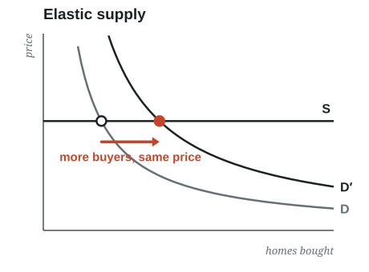

[Credit changes [who owns]{.gain-t}]{.colhead}

Looser credit lets constrained households buy. Ownership responds, prices barely move [@kaplan2020housing].
:::
::: {.prose}
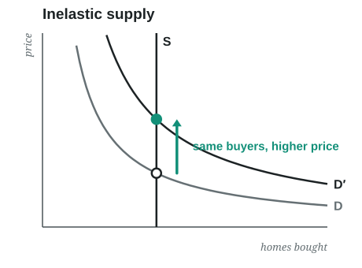

[Credit changes [what it costs]{.yield-t}]{.colhead}

With a fixed stock, looser credit raises every bid. Prices absorb the shock and the ranking of bidders is unchanged [@greenwald2021credit].
:::
:::

::: {.notes}
Both models agree that borrowing limits bind. They disagree about what happens when the limits move, and that is what the 2003 reform lets us observe. The diagrams carry the argument: same demand shift, different margin of adjustment. Keep the text to a sentence each and hand off to the reform.
:::

## Introduction of interest-only mortgages as a credit shock 

::: {.prose}
From 2003 Danish borrowers could defer amortization for ten years. Payments on the same loan fell by about [20 percent]{.num}, relaxing the payment-to-income limit. Interest-only loans financed more than [60]{.num} percent of purchases across the income distribution.

[On the reform's effect on mortgage debt and homeownership, see @backman2024interest, @backman2025mortgage and @backman2020impact.]{.source}
:::

::: {.split .even .cols}
::: {.prose}
[If credit changes [who owns]{.gain-t}]{.colhead}

The share of lower-income buyers in high-growth municipalities rises after 2003.
:::
::: {.prose}
[If credit changes [what it costs]{.yield-t}]{.colhead}

Prices in high-growth municipalities rise after 2003. The share of lower-income buyers does not.
:::
:::


::: {.notes}
The two columns repeat the two predictions from the previous slide, now as outcomes we can measure. Say the reform was large and broadly used before showing the null, so the room does not read the flat composition series as a weak treatment.
:::

## The composition of buyers did not change

::: {.prose}
   $$Lownc_{imt} = \alpha_m + \gamma_t + \sum_{k=1998,\, k\neq 2003}^{2010} \beta_k (HighGrowth_m \times \mathbf{1}_{t=k}) + X_{it}\Gamma + \epsilon_{imt}$$

:::

::: {.figwrap .pair}
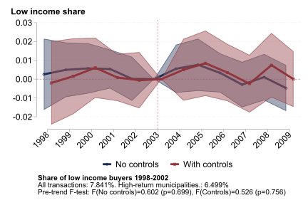
:::
[Event-study coefficients for high-growth municipalities relative to others. 95 percent confidence intervals. High-growth municipalities are the top fifth by 1997–2002 price growth. The 2016 macroprudential tightening in Copenhagen and Aarhus shows the same pattern in reverse.]{.figcap}


## Conclusion

::: {.claims}
- Housing capital gains rise with income rank, **1.36 pp** a year between the 90th and 10th percentiles.
- Location statistically accounts for **88 percent** of the gradient. 
- Imputed rental yields **equalize total returns**. The additive total-return gradient is statistically zero.
- **Composition differs.** Capital gains compound into transferable wealth. Housing services are consumed. Housing contributes **1.3 pp** to the P90–P10 wealth-return gap under the additive measure, all of it through portfolio shares rather than returns.
- Indivisibility and income-based borrowing limits narrow **choice sets where growth is**. Relaxing credit in 2003 raised prices and left the buyer mix unchanged. Credit policy does not change who buys where, whether because supply is fixed or because buyers stay by choice.
:::

## Returns on housing determined by where a household buy, not by how it invests

[Where households live and consume is also where their returns come from.]{.source}

**Thank you!**

[Claes Bäckman]{.source}
[Leibniz Institute for Financial Research SAFE]{.source}
[claes.backman@gmail.com]{.source}


```{=html}
<div class="stage skyline" data-chart="skyline"></div>
```

## Appendix {.divider .center visibility="uncounted"}


## Location accounts for 88 percent of the explained movement {visibility="uncounted"}

::: {.split .wide-left}
::: {.figwrap}
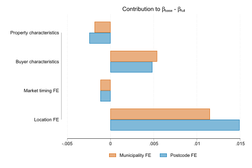
:::
::: {.prose}
A Gelbach [-@gelbach2016covariates] decomposition attributes the shrinkage in the coefficient to groups of controls independently of their order.

::: {.stat}
[88%]{.k}
[location, under postcode fixed effects. Timing 6 percent, buyer characteristics 5, property characteristics 1.]{.l}
:::

[A statement about what accounts for the gradient statistically, not about what causes it.]{.source}
:::
:::


## High-price, high-appreciation markets have low rental yields {visibility="uncounted"}

::: {.prose}
Yields are imputed at the postcode and municipality level from the 1999 register cross-section of unit-level rents, as rent per square meter over price per square meter
:::

::: {.figwrap .pair}

:::


## Equal housing returns, unequal portfolio returns {visibility="uncounted"}

::: {.split .wide-left}
```{=html}
<div class="stage" data-chart="decomp-measures"></div>
```
::: {.prose}
Decompose each asset's contribution to the P90–P10 gap in the return on gross assets into what households **hold**, what they **earn**, and the interaction, following @kuhn2020income.

Under the additive measure the within term is zero by construction. Housing still contributes [1.32]{.num .gain-t} pp, entirely through composition.

Under the IRR the negative gradient turns the within and interaction terms negative and housing's contribution falls to [0.32]{.num}.
:::
:::

::: {.notes}
The toggle is the argument. Click through the three measures and let the room watch the within bar collapse while the housing total barely moves. The reason is the share gap on the previous slide, not the return gap.
:::


## Within Copenhagen the gradient is slightly negative

::: {.split .wide-left}
::: {.figwrap}
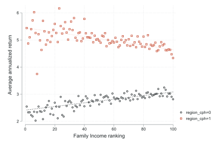
:::
::: {.prose}
Within the Capital region, higher income predicts a slightly *lower* gain, [−0.004]{.num} per rank point with postcode and timing fixed effects.

The national gradient reflects exposure to high-growth locations and not better within-market performance.

[Average annualized capital gain by income rank, capital region and rest of Denmark.]{.source}
:::
:::


## A suspect needs two things at once

::: {.split}
::: {.prose}
A candidate explanation has to both [predict capital gains]{.gain-t} and [differ between Anna and Bo]{.bo-t}. 

[Market timing: predicts yes, differs barely, product near zero.]{.source} 

[Municipality: predicts yes, differs yes, product large. 
45 percent of top-decile buyers purchase in the capital region against 27 percent of bottom-decile buyers.]{.source}
:::
```{=html}
<div class="stage" data-chart="two-dials"></div>
```
:::

::: {.notes}
Give the room the rule before the results, so the specification ladder on the next slide reads as a test rather than a list. The framing also answers "did you control for X?" in advance: X has to move both dials, and most candidate Xs move only one.
:::


## Interpretation: constraints plus inelastic supply

::: {.prose}
With a fixed stock of dwellings allocated to the highest bidders, a proportional increase in borrowing capacity raises every bid and the clearing price but leaves the ranking of bids unchanged. Composition can move only where supply responds. The evidence is consistent with this reading and inconsistent with a simple credit-access account. We do not isolate a single cause.
:::

::: {.figwrap .pair}
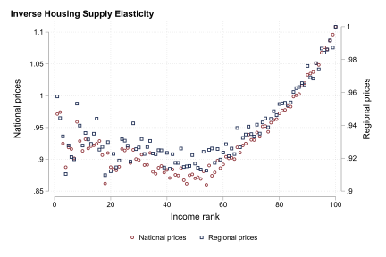
:::

[Inverse housing supply elasticity [@guren2021housing]. Fixed supply and persistent price growth in high-price cities [@gyourko2013superstar]. **Left:** by municipality. **Right:** by the income rank of buyers, national and regional prices. The variable is an *inverse* elasticity.]{.figcap}

## Risk does not account for the gradient {visibility="uncounted"}

::: {.prose}
Moving from the 10th to the 90th percentile raises the standard deviation of log house-price growth by about [0.008]{.num}. At a benchmark Sharpe ratio of 0.36 [@doeswijk2020historical], the implied premium is at most 21 percent of the baseline gap. ¨
:::

::: {.figwrap .pair}
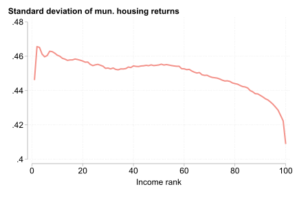

:::

## Total returns under the internal rate of return {visibility="uncounted"}

::: {.figwrap .pair}


:::

[**Left:** implied annual rental yield. **Right:** total return. The IRR nets out maintenance, property tax and transaction costs.]{.figcap}

## IRR gradient across specifications {visibility="uncounted"}

::: {.figwrap .pair}


:::

## Imputed capital gains for single transactions {visibility="uncounted"}

::: {.figwrap .pair}
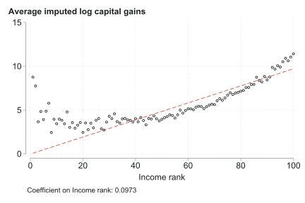
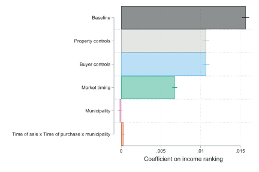
:::

[Capital gains imputed for properties that sold once, by income rank, binned means and regression coefficients.]{.figcap}

## Maximum purchase price by income rank {visibility="uncounted"}

::: {.figwrap .tall}
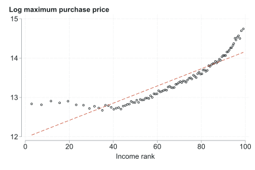
:::

## Municipality-level capital gains by buyer rank {visibility="uncounted"}

::: {.figwrap .pair}
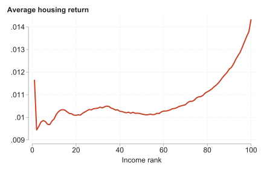

:::

## Homeownership by income {visibility="uncounted"}

::: {.figwrap .tall}
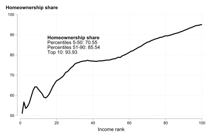
:::

## Aggregate house-price growth {visibility="uncounted"}

::: {.figwrap .tall}
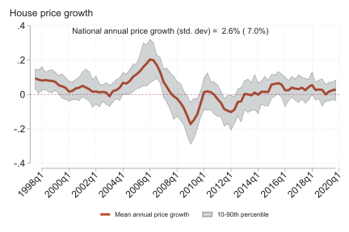
:::

## External validity: US ZIP codes by 2000 price level {visibility="uncounted"}

::: {.figwrap .tall}
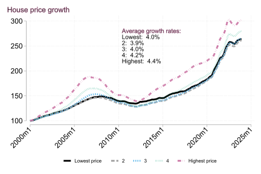
:::


## References {visibility="uncounted"}

::: {#refs}
:::
