## Do housing returns differ across the income distribution, and, if so, why?

## Two buyers, one country

::: {.split .center-v}
::: {.prose}
[**Anna**]{.anna-t} earns less than nine in ten Danes her age. [**Bo**]{.bo-t} earns more than nine in ten.

Both bought a home in 2005 and sold it ten years later. Who earned higher returns? 

[Why do returns to wealth differ?]{.q}

[The returns-to-wealth literature answers with risk tolerance, skill and time preference [@fagereng2020heterogeneity; @bach2020rich]. Those answers sit awkwardly on housing, the largest asset most households own and the one they also have to live in.]{.note}
:::
```{=html}
<div class="stage" data-chart="two-buyers"></div>
```
:::

::: {.notes}
Open here, not on the literature. Ask the room to commit before the reveal — a show of hands works. Most audiences say the high-income buyer, and they are right about capital gains and wrong about the total. That gap between the two answers is the paper.
:::

## It depends what you count

::: {.split .center-v}
::: {.prose}
**Bo's home rose in price faster.** About [1.36 percentage points]{.num .gain-t} a year
faster, which over ten years is roughly [15 percent]{.num .gain-t} more.

**But Anna's home carried a higher rental yield.** The housing service flow offsets the lower capital gain, leaving total returns approximately equalized.

:::
```{=html}
<div class="stage" data-chart="reveal" data-animate></div>
```
:::

::: {.notes}
This is the slide that reframes the project relative to earlier versions of the paper. We used to stop at the capital-gains gap. The honest total-return statement is that the gap closes, and the interesting object becomes composition rather than level. Say plainly that this makes the finding harder, not easier, to sell as inequality — and then show why composition is what matters for wealth.
:::

## Preview of results

::: {.claims}
- **Capital gains rise with income rank.** 1.36 pp a year between the 90th and 10th percentiles, 14.6 percent over a ten-year hold.
- **Location accounts for the gradient.** Postcode fixed effects absorb 88 percent of the movement in the coefficient. Within Copenhagen the gradient is slightly negative.
- **Total returns are roughly equalized.** Imputed rental yields fall with income about as fast as capital gains rise. The total-return gradient is statistically zero.
- **Choice sets differ across buyers** Housing is indivisible and financed by mortgage debt, which limits lower-income buyers more
- **Relaxing credit did not change who buys.** After the 2003 interest-only reform, prices rose in high-growth municipalities. The income composition of buyers did not move.
:::

## Data and measurement

- Danish administrative registers, 1996–2022. About 218,000 repeat sales.

- Income rank is average within buyers in the year before purchase, ranked within year and age cohort.

- Capital gains based on transaction-level data. 

- Rental yields imputed using cross-sectional rents from 1996 and 1999. Validated against private market rental data 2015-222. 


## 1 · The capital-gain gradient {.divider .center}

## Capital gains rise by 0.017 pp per income-rank point

::: {.split .wide-left}
::: {.figwrap}
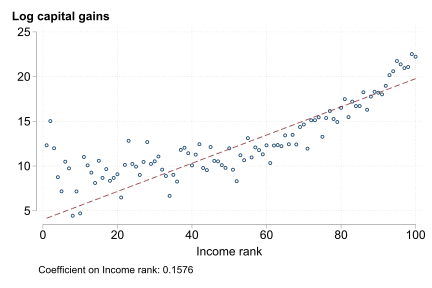
:::
::: {.prose}
Annualized real capital gains are close to linear in income rank across the whole distribution.

::: {.stat}
[0.017]{.k}
[pp per rank point, or 1.36 pp between the 90th and 10th percentiles]{.l}
:::

[Binned means of annualized real capital gains by income rank.]{.source}
:::
:::


## 2 · Location, not property or timing {.divider .center}

## Location fixed effects absorb the gradient

::: {.split .wide-left}
::: {.figwrap}
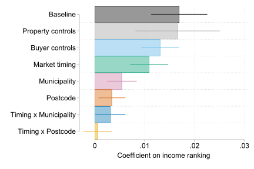
:::
::: {.prose}
$Y_{i}=\beta_0+\beta_1\text{Income Rank}_{i} + X_{i}\Gamma + \epsilon_{i}$


Property and buyer characteristics and purchase- and sale-year fixed effects leave most of the coefficient intact.

Municipality fixed effects remove two-thirds, postcode fixed effects four-fifths. Postcode-by-year fixed effects leave a coefficient statistically indistinguishable from zero.

[Coefficient on income rank across specifications, 95 percent confidence intervals. Controls are cumulative.]{.source}
:::
:::


## Location accounts for 88 percent of the explained movement

::: {.split .wide-left}
::: {.figwrap}

:::
::: {.prose}
A Gelbach [-@gelbach2016covariates] decomposition attributes the shrinkage in the coefficient to groups of controls independently of their order.

::: {.stat}
[88%]{.k}
[location, under postcode fixed effects. Timing 6 percent, buyer characteristics 5, property characteristics 1.]{.l}
:::

[A statement about what accounts for the gradient statistically, not about what causes it.]{.source}
:::
:::


## 3 · Total returns {.divider .center}

## High-price, high-appreciation markets have low rental yields

::: {.prose}
Yields are imputed at the postcode and municipality level from the 1999 register cross-section of unit-level rents, as rent per square meter over price per square meter
:::

::: {.figwrap .pair}
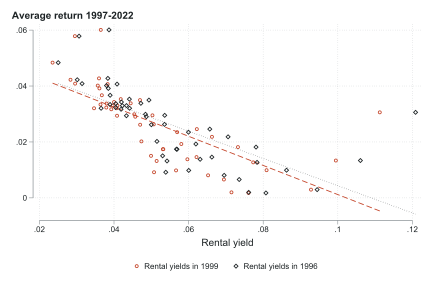
:::


## The yield gradient offsets the capital-gain gradient

::: {.split .wide-left}
::: {.figwrap}
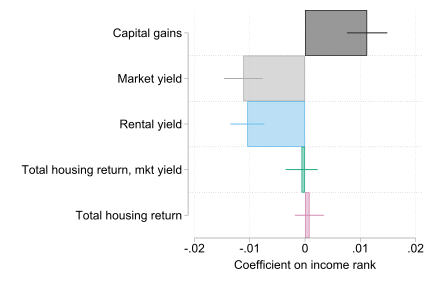
:::
::: {.prose}
::: {.stats .col}

:::

The total-return gradient is statistically insignificant and stable across specifications. 

Using an internal-rate-of-return measure that nets out carrying costs it is [−0.031]{.num}.

@amaral2021superstar find similar results across countries for urban/rural split

[Additive measure, adding property, buyer and market-timing controls progressively.]{.source}
:::
:::

## Equal totals, different composition

::: {.split .center-v}
::: {.prose}
Higher-income buyers realize their return as [capital gains]{.gain-t}. 

Lower-income buyers realize the same total as [housing services]{.yield-t}, a continuous flow that they consume. 

[Composition of returns is what differs across the income distribution.]{.q}

:::
```{=html}
<div class="stage terse" data-chart="shape"></div>
```
:::

## 4 · Why is the composition different? {.divider .center}

## Difference in return compositon is explaned by [location]{.gain-t}

::: {.prose}
Higher-income buyers earn systematically buy in [expensive]{.yield-t} locations with high house price growth and low rental yields. 

**We argue that financial constraints and consumption needs restrict low-income buyers from these areas.** 

:::
## Choice sets are smallest where capital gains are largest

::: {.prose}
Share of same-year transactions a buyer could finance under maximum borrowing. Bottom third: about 40 percent. Top third: over 60 percent. In high-growth areas, holding dwelling size fixed, a rank-40 buyer reaches about a fifth.
:::

::: {.figwrap .pair}
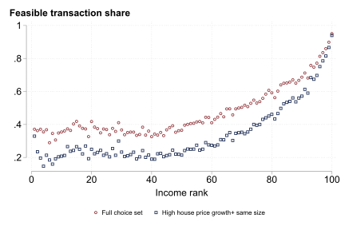
:::

[High-growth areas are municipalities in the top quintile of average capital gains.]{.figcap}

## The payment-to-income limit binds for over half of buyers

::: {.split .wide-left}
::: {.figwrap}
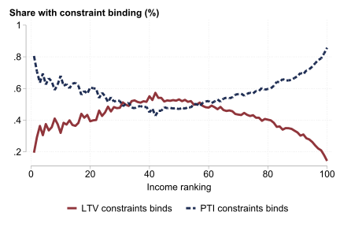
:::
::: {.prose}
The loan-to-value limit binds mostly in the middle of the distribution. The payment-to-income limit binds for slightly over half of buyers overall.

[Share of buyers for whom each constraint binds, by income rank.]{.source}
:::
:::

## 5 · The 2003 interest-only reform {.divider .center}

## Interest-only mortgages were introduced in 2003 

::: {.prose}
Led to payments on the same loan fell by roughly 20 percent. 

Uptake exceeded 60 percent of purchases across the income distribution.

**If borrowing constraints keep lower-income households out of high-growth markets, their share of purchases there should rise.**
:::

## Prices rose. The composition of buyers did not.

::: {.prose}
Event-study coefficients for high-growth municipalities relative to others. The share of lower-income buyers is flat before and after 2003. Log prices step up. The 2016 macroprudential tightening in Copenhagen and Aarhus shows the same pattern in reverse.
:::

::: {.figwrap .pair}

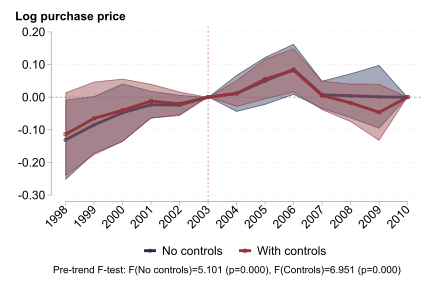
:::

[**Left:** share of lower-income buyers. **Right:** log house prices. 95 percent confidence intervals. High-growth municipalities are the top fifth by 1997–2002 price growth.]{.figcap}


## 6 · Composition and wealth {.divider .center}

## Only the capital gain lands on the balance sheet

::: {.split .wide-left}
::: {.figwrap}
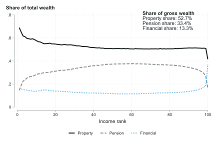
:::
::: {.prose}
Write the change in net worth as

[ΔW = [gH]{.gain-t} + G^O^ + S^A^]{.q}

The capital gain [gH]{.gain-t} accrues directly as an asset value. The rental yield is consumed as housing services. 

Equal total returns therefore need not imply equal wealth accumulation. 

[Valuation gains on other assets are G^O^ and active saving is S^A^. The identity is an accounting statement, not a behavioral one. Share of gross wealth by asset class and income rank, Danish registers.]{.source}
:::
:::

::: {.notes}
This is the hinge of the section. The previous slide established equal totals. This one says why that is not the end of the story: the two components enter the balance sheet differently, and the identity makes it precise without assuming anything about behavior.
:::

## Equal housing returns, unequal portfolio returns

::: {.split .wide-left}
```{=html}
<div class="stage" data-chart="decomp-measures"></div>
```
::: {.prose}
Decompose each asset's contribution to the P90–P10 gap in the return on gross assets into what households **hold**, what they **earn**, and the interaction, following @kuhn2020income.

Under the additive measure the within term is zero by construction. Housing still contributes [1.32]{.num .gain-t} pp, entirely through composition.

Under the IRR the negative gradient turns the within and interaction terms negative and housing's contribution falls to [0.32]{.num}.
:::
:::

::: {.notes}
The toggle is the argument. Click through the three measures and let the room watch the within bar collapse while the housing total barely moves. The reason is the share gap on the previous slide, not the return gap.
:::

## Conclusion

::: {.claims}
- Housing capital gains rise with income rank, **1.36 pp** a year between the 90th and 10th percentiles.
- Location statistically accounts for **88 percent** of the gradient. Within cities it is slightly negative.
- Imputed rental yields **equalize total returns**. The additive total-return gradient is statistically zero.
- **Composition differs.** Capital gains compound into transferable wealth. Housing services are consumed. Housing contributes **1.3 pp** to the P90–P10 wealth-return gap under the additive measure, all of it through portfolio shares rather than returns.
- Indivisibility and income-based borrowing limits narrow **choice sets where growth is**. Relaxing credit in 2003 raised prices and left the buyer mix unchanged, consistent with constraints plus inelastic supply.
:::

## To understand returns on the largest asset on the household balance sheet, we need to consider factors that are specific to the unique nature of housing

**Thank you!**

[Claes Bäckman]{.source}
[Leibniz Institute for Financial Research SAFE]{.source}
[claes.backman@gmail.com]{.source}


```{=html}
<div class="stage skyline" data-chart="skyline"></div>
```
:::

## Appendix {.divider .center visibility="uncounted"}


## Within Copenhagen the gradient is slightly negative

::: {.split .wide-left}
::: {.figwrap}

:::
::: {.prose}
Within the Capital region, higher income predicts a slightly *lower* gain, [−0.004]{.num} per rank point with postcode and timing fixed effects.

The national gradient reflects exposure to high-growth locations and not better within-market performance.

[Average annualized capital gain by income rank, capital region and rest of Denmark.]{.source}
:::
:::


## A suspect needs two things at once

::: {.split}
::: {.prose}
A candidate explanation has to both [predict capital gains]{.gain-t} and [differ between Anna and Bo]{.bo-t}. 

[Market timing: predicts yes, differs barely, product near zero.]{.source} 

[Municipality: predicts yes, differs yes, product large. 
45 percent of top-decile buyers purchase in the capital region against 27 percent of bottom-decile buyers.]{.source}
:::
```{=html}
<div class="stage" data-chart="two-dials"></div>
```
:::

::: {.notes}
Give the room the rule before the results, so the specification ladder on the next slide reads as a test rather than a list. The framing also answers "did you control for X?" in advance: X has to move both dials, and most candidate Xs move only one.
:::


## Interpretation: constraints plus inelastic supply

::: {.prose}
With a fixed stock of dwellings allocated to the highest bidders, a proportional increase in borrowing capacity raises every bid and the clearing price but leaves the ranking of bids unchanged. Composition can move only where supply responds. The evidence is consistent with this reading and inconsistent with a simple credit-access account. We do not isolate a single cause.
:::

::: {.figwrap .pair}

:::

[Inverse housing supply elasticity [@guren2021housing]. **Left:** by municipality. **Right:** by the income rank of buyers, national and regional prices. The variable is an *inverse* elasticity.]{.figcap}

## Risk does not account for the gradient {visibility="uncounted"}

::: {.prose}
Moving from the 10th to the 90th percentile raises the standard deviation of log house-price growth by about [0.008]{.num}. At a benchmark Sharpe ratio of 0.36 [@doeswijk2020historical], the implied premium is at most 21 percent of the baseline gap. ¨
:::

::: {.figwrap .pair}

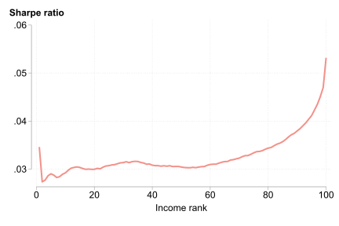
:::

## Total returns under the internal rate of return {visibility="uncounted"}

::: {.figwrap .pair}
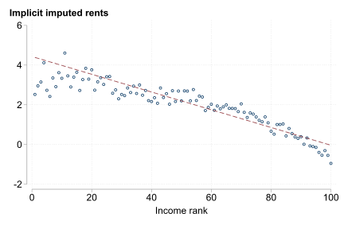
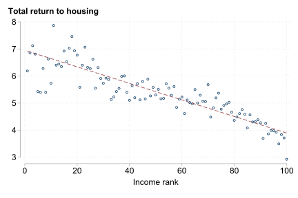
:::

[**Left:** implied annual rental yield. **Right:** total return. The IRR nets out maintenance, property tax and transaction costs.]{.figcap}

## IRR gradient across specifications {visibility="uncounted"}

::: {.figwrap .pair}
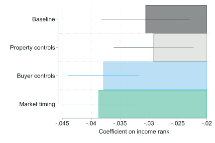
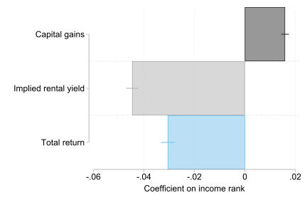
:::

## Imputed capital gains for single transactions {visibility="uncounted"}

::: {.figwrap .pair}


:::

[Capital gains imputed for properties that sold once, by income rank, binned means and regression coefficients.]{.figcap}

## Maximum purchase price by income rank {visibility="uncounted"}

::: {.figwrap .tall}

:::

## Municipality-level capital gains by buyer rank {visibility="uncounted"}

::: {.figwrap .pair}

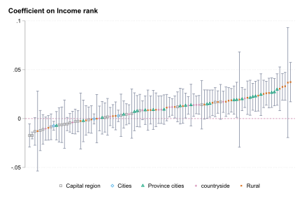
:::

## Homeownership by income {visibility="uncounted"}

::: {.figwrap .tall}

:::

## Aggregate house-price growth {visibility="uncounted"}

::: {.figwrap .tall}

:::

## External validity: US ZIP codes by 2000 price level {visibility="uncounted"}

::: {.figwrap .tall}

:::


## References {visibility="uncounted"}

::: {#refs}
:::
