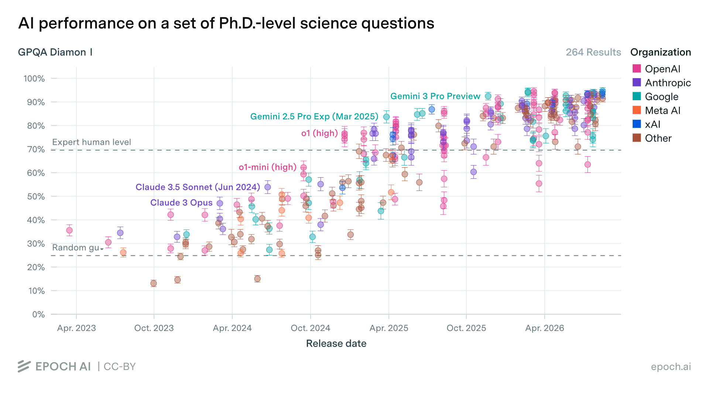
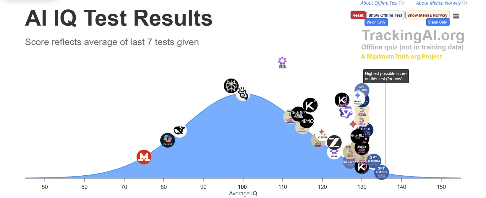
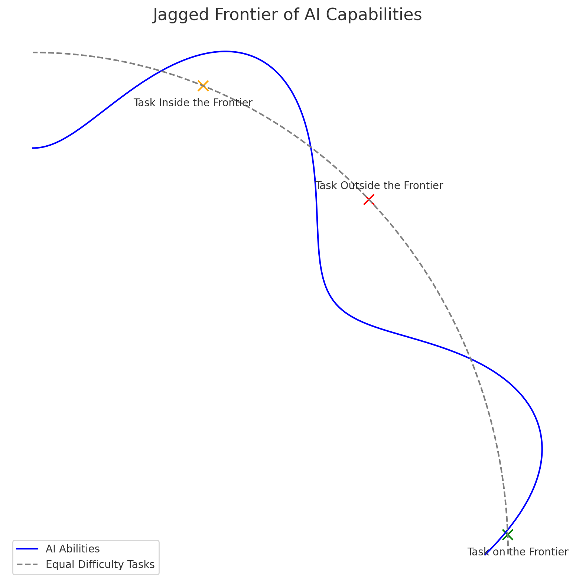
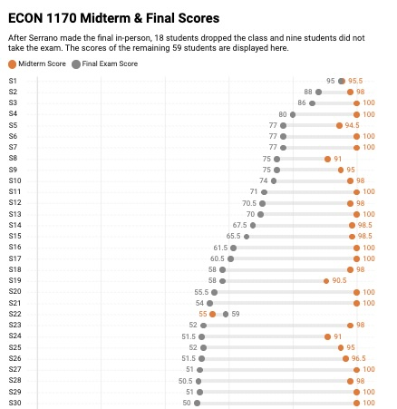
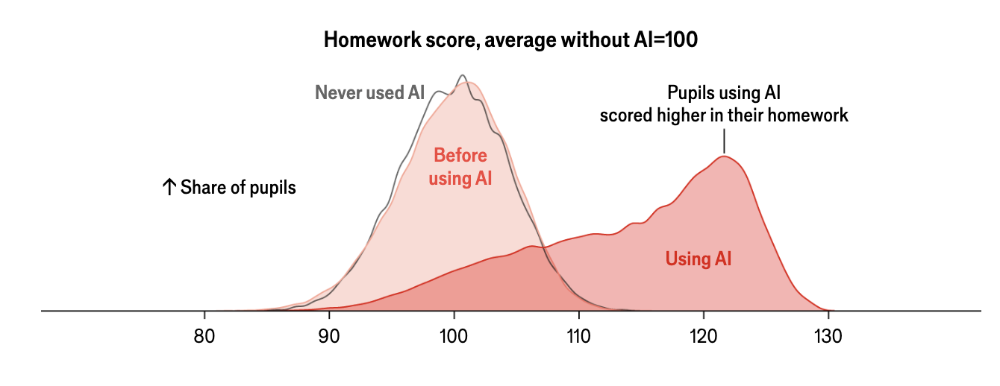
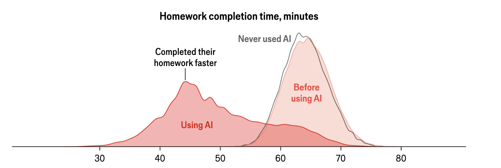
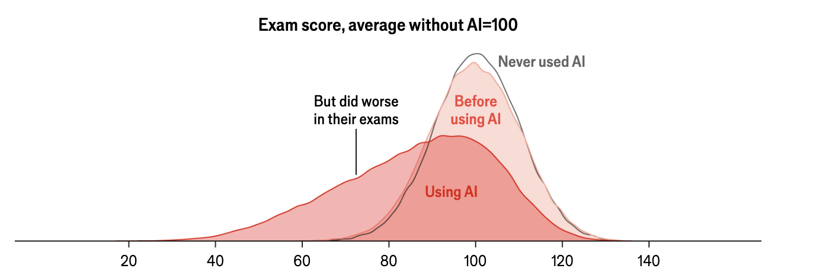

##  Let's start with an example -- building a website for a paper 

<!-- 
## Two ways of working, one paper. {#hook}

::: {.split .center-v}
::: {.prose}
[Anna]{.chat-t} uploads the PDF to a chatbot and asks for a website. She gets pages of HTML in a chat window, to copy somewhere herself.

[Ben]{.agent-t} opens the paper's folder in an agent and types one sentence. The agent reads the paper, writes the files, opens the page, and fixes what broke.

::: {.bet}
[Who is looking at a finished page first, and by how much?]{.q}
:::
:::
```{=html}
<div class="stage" data-chart="two-researchers"></div>
```
:::
--> 
::: {.notes}
Before this slide: start the live demo in a terminal behind the deck. Open the example paper's folder in Claude Code and type "build a website that presents this paper, following CLAUDE.md". Let it run while you talk; the check-in slide at the end of section 3 switches to the browser.

Ask the room how they would have done this last month: paste the paper into a chatbot, or hand the folder to an agent. Say that this is the day's subject: what an agent does that a chat window does not, what it costs to set up, and what you have to check afterwards. Section 1 starts with what both tools have in common, the model.
:::

## Three messages: AI is here, the workflow matters more than the model, and verification is key.

::: {.claims}
- **The tools changed.** Chat gave way to agents that read files, run code and iterate. The tool you tried in 2023 is not the tool of today. 
- **The workflow is the value.** The agent’s leverage comes from
context (your files), standing instructions, and reusable skills — not from raw model IQ.
- **Judging the output is the new job.** Silent errors and confident statements with no backing are what you should look out for. 
:::

[Workshop synthesis, drawing on @mollick2026guide, @velikov2026guide and Korinek (2025).]{.source}

::: {.notes}
This is the map, not the argument; the argument starts on the next section. Claim one is sections 1 and 2, claim two is sections 4 to 6, claim three is section 7. Section 8 applies all three to teaching. Say that each claim will be earned by something on a slide, and that the second one is what the website demo running in the background shows.
:::

## A brief example on developments since 2023

## Eight steps now, hands-on later

```{=html}
<div class="agenda">
<div><b>1</b><span>What an LLM is</span><small>Prediction, not lookup. Confident when wrong.</small></div>
<div><b>2</b><span>Landscape</span><small>Three model generations; who uses them.</small></div>
<div><b>3</b><span>Use cases</span><small>Research, coding, admin.</small></div>
<div><b>4</b><span>How the tools work</span><small>The harness, context, the loop.</small></div>
<div><b>5</b><span>Choosing a tool</span><small>Chat vs. agent; pricing and models.</small></div>
<div><b>6</b><span>In practice</span><small>A prompt to copy; things to try.</small></div>
<div><b>7</b><span>Verification</span><small>Four checks for silent errors.</small></div>
<div><b>8</b><span>Teaching</span><small>Protect learning, then teach more.</small></div>
</div>
```

::: {.prose}
**Session 2.** Hands-on with your own materials: a referee report on your draft, secure data, writing, the paper–code link.

**Slides, skills and guides for both days:** [claesbackman.com/ai_workshop](https://claesbackman.com/ai_workshop).
:::

::: {.notes}
Point at the URL and say it will still be there next month. The guides linked from that page (Claude Code vs. Codex, VS Code setup, verification, Overleaf) cover what the slides skip. Do not read the eight boxes.
:::

## 1 · An LLM predicts the next token {.divider .center style="--fill:10%"}

## An LLM predicts the next token, over and over, very well {#next-token}

::: {.stack}
::: {.prose}
A token is a word or a piece of a word, about four characters of English. That is the whole training objective: given the text so far, predict the next token. Press the button.
:::
```{=html}
<div class="stage" data-chart="next-token"></div>
```
:::

::: {.notes}
The move: press "Sample the next token" six times, slowly. Each press appends the most likely candidate and recomputes the list. Say after the third press: "Notice that at no point did the model consult a table of Danish house prices. It has a distribution over words, that is all." The probabilities are invented for the slide; the mechanism is not. If the stage does not respond, the static state shows the finished sentence, and you narrate the same thing. "LLM" is large language model; say it once.
:::

## So it is a prediction machine, not a lookup machine

::: {.three}
::: {.panel}
[Not a database]{.ph}
<p>It does not look facts up. It generates text that is plausible given what it has seen.</p>
:::
::: {.panel}
[Not a calculator]{.ph}
<p>It predicts what an answer looks like. The arithmetic is right when the pattern is common, and the tools in section 4 exist because of this.</p>
:::
::: {.panel}
[Not connected to your files]{.ph}
<p>Or to the live web, unless the tool around it adds that. Out of the box it knows nothing about your paper.</p>
:::
:::

::: {.prose}
An invented citation is a sequence of plausible tokens. "Smith and Jones (2019)" is very plausible.
:::

::: {.notes}
Say the citation sentence and let it land: every failure the room has seen (invented references, wrong coauthors, confident nonsense) is the token stage again. The "not a calculator" panel is why agents run code instead of doing arithmetic in their head; that comes back on the harness slide.
:::

## A useful mental model

::: {.big}
[A very well-read, very fast colleague who has read almost everything but remembers none of it precisely, has no access to your files, **will never admit to not knowing**, and is **unapologetic about being wrong**.]{.q}
:::

::: {.notes}
Read the sentence. Let the last two clauses land. "Never admits to not knowing" is an exaggeration in 2026, and say so if challenged: the models refuse and hedge more than they did, but they still fill gaps with plausible text. Then: what happens if the same colleague has the paper in front of them? Next slide.
:::
<!--
## But give it the paper, and the same predictor becomes specific {#context-turn}

::: {.split .even .cols}
::: {.prose}
[Ask about a paper it has not been given]{.colhead .chat}

*"What is the identification strategy in Bäckman and Khorunzhina's paper on housing returns?"*

The model has the title and its training data. It predicts what such a paper probably does: a plausible method, a plausible result, confidently. Some of it will be wrong.
:::
::: {.prose}
[Ask with the paper in the conversation]{.colhead .agent}

*Same question, PDF attached.*

The predictions are now conditioned on the actual text. The answer quotes section 4, names the assumption, and can be checked against the page.
:::
:::

::: {.prose}
[Same model. The difference is what was in the context window: the text the model can see when it predicts.]{.q}
:::

::: {.notes}
The first turn of the day and the sentence to repeat. If the demo machine is up, do this live in claude.ai with one of your own papers: ask without the PDF, then attach it and ask again. Anna's chatbot is not a worse model, it is a model with less to condition on. Ben's agent goes and gets the paper itself; that is section 4. "Mostly right" is deliberate: section 7 is about the rest.
:::
--> 
## The message in one sentence

::: {.big}
[Context improves AI tools tremendously, and the goal is to provide the right context.]{.q}

[Everything else today is a way of doing that, or of checking what came back.]{.sub}
:::

::: {.notes}
Say it, pause, move on. It comes back at the end of section 5 with the tools compared.
:::

## 2 · The landscape moved from chat to agents {.divider .center style="--fill:22%"}

## Three generations in four years: chat, reasoning, agents

::: {.stack}
```{=html}
<div class="stage" data-chart="generations"></div>
```
:::

::: {.notes}
Walk left to right. "Spawns subagents" on the third box means the agent can start a fresh copy of itself with its own context window to do a sub-task; that is what "use a subagent" means when it comes up in section 7. The point of the third box: an agent can read the folder itself. The context problem from the last section is what agents solve.
:::

## On PhD-level science questions, models are now above expert level

::: {.figwrap .wide}

:::

[GPQA Diamond accuracy by model release date, 264 results; each dot is one model. Dashed lines: random guessing (25 percent) and expert human level (about 70 percent). Epoch AI, CC-BY.]{.figcap}

::: {.notes}
Three years from the bottom dashed line to above the top one; the figure's own labels are small, so say the two levels aloud. Do not oversell benchmarks; say only that the trend is not a marketing claim, and that the vendor colours in the figure do not matter for the argument.
:::

## Models differ

::: {.figwrap .wide}

:::


## Efforts underway to automate research 

::: {.claims}
- **Paul Novosad** wrote a paper with AI in about three hours, then another one with the opposite result [@novosad2026ai].
- **Project APE** has automated 1,000 policy-evaluation papers.
- **Alejandro López-Lira** built a system that finds a problem, generates a theory, verifies it adversarially and writes a publication-ready paper.
- **@novy2026artificial** describe how academic research could be automated with LLMs, and what that does to the literature.
:::

[Links to Project APE and López-Lira's system are on the workshop resources page.]{.source}

::: {.notes}
Dwell on Novosad: the same tool produced the opposite result on request. That anecdote is the verification section in miniature, and it comes back there. Nothing on this slide says the thousand papers are any good; that is the point of the next two sections.
:::

## Agents raise econometric coding success from 74 to 96 percent

::: {.split .even}
::: {.prose}
@galiani2026ai benchmark applied econometric tasks in Stata, R and Python. Moving from a chatbot that writes one script to an agent that runs and revises its own code is what raises task success.

Under the chatbot, results differ a lot by software. Under the agent, the differences largely disappear.
:::
::: {.prose}
::: {.stats .two}
::: {.stat}
[74 → 96%]{.k .f}
[task success, chatbot to constrained agent]{.l}
:::
::: {.stat}
[8 cents]{.k .f}
[extra cost per run]{.l}
:::
:::

[@galiani2026ai, NBER working paper 35588, abstract. "Constrained agent": one that runs its code and fixes errors, but within a fixed set of tools.]{.source}
:::
:::

::: {.notes}
Boris Cherny, who runs Claude Code at Anthropic, says "coding is largely solved"; quote it as a vendor's claim and let Galiani et al. be the evidence. The agent's advantage is exactly the loop: it runs the code, sees the error, fixes it. A chatbot hands you a script and hopes. The loop is drawn in section 4.
:::

## But the frontier is jagged

::: {.split}
::: {.prose}
Two tasks that look equally hard to you can sit on opposite sides of the line.

Drafting prose, summarising a literature, re-deriving a table: inside. But some things are outside, and figuring out which is difficult ex-ante. 

Consultants in Dell'Acqua et al.'s field experiment did better inside the frontier and worse outside it, because they trusted the tool in both places.

[@dell2026navigating; Ethan Mollick's "jagged frontier".]{.source}
:::
::: {.figwrap}

:::
:::

::: {.notes}
The BUT after three slides of pace. The dashed line is tasks that look equally hard to a person. The orange one sits inside the blue frontier, the red one outside it, the green one on the edge. Map the frontier for your own tasks before you trust it; the wrong-fixed-effect example is the one section 7 is built around.
:::

## 

::: {.big}
::: {.bet}
[Who has used ChatGPT or Claude inside an IDE or terminal? Who has used Claude Code or the Claude desktop app?
]{.q}
:::

[What share of economists in a survey of 1,260 social scientists use a coding agent?]{.sub}
:::

::: {.notes}
Two counts, then a number from the room. Write the guess on the whiteboard. The next slide animates the answer in.
:::

## Most social scientists use AI, few use an agent {#adoption}

::: {.split}
::: {.prose}
Open dots: anyone using AI at all. 

::: {.fragment}
Four in five use some AI tool. One in five uses an agent. Economists are still under forty percent.

**Most use chat only**

**The caveat that this was a really long time ago (February/March).**
:::

[@lyttelton2026agents, survey of 1,260 social scientists, February–March 2026.]{.source}
:::
```{=html}
<div class="stage tall" data-chart="adoption-field" data-animate></div>
```
:::

::: {.notes}
On arrival only the open dots are drawn. The move: click anywhere on the chart, and the blue dots detach from the open ones and slide left to their true values; the Economics answer is set large. Then press once for the sentence with the numbers, and compare with the guess on the whiteboard and the show of hands. Economics leads every other field on agents by a wide margin, and is still under forty percent. The respondents chose to answer an Anthropic survey, so the levels are upper bounds; the ordering is what to trust.
:::

## Adoption falls with seniority

::: {.split}
::: {.prose}
About a quarter of PhD students use a coding agent. Fewer than one in ten full professors do.

Different readings: seniors have less to gain, seniors have RAs who use agents, or seniors face the highest switching cost. 

[@lyttelton2026agents.]{.source}
:::
```{=html}
<div class="stage" data-chart="adoption-career"></div>
```
:::

::: {.notes}
The shaded band is people in training. Full professors also have RAs and coauthors to delegate to, which is the third reading; say it if asked. The admin slide in section 3 is the answer to all three.
:::

## Agent users do more of everything, especially drafting

::: {.split}
::: {.prose}
Code is nearly universal among agent users. 

More than half of agent users draft with it, fewer than a third of other users do.

[@lyttelton2026agents.]{.source}
:::
```{=html}
<div class="stage" data-chart="adoption-use"></div>
```
:::

::: {.notes}
Agent blue against chat ochre. This closes the landscape section and opens the question of what to use it for.
:::

## 3 · Use cases for AI {.divider .center style="--fill:34%"}


## AI is going to change how we do research

::: {.split .even .cols}
::: {.prose}
[Same research, done faster]{.colhead}

**Faster coding.** Stata, R and Python drafts, debugging error logs, robustness checks, replication packages.

**Better writing.** Structured critique, edits in your own voice, pre-submission referee reports.
:::
::: {.prose}
[New outputs, new projects]{.colhead}

**New ways to communicate a paper.** An interactive website, a policy brief, a dashboard or an audio summary, all from the same paper.

**New kinds of projects.** Mass automation (Project APE), automated replication and extension [@schwartz2026llm], AI agents as simulated humans (Expected Parrot), ??? 
:::
:::

::: {.notes}
The left column is the three-jobs slide in one line: the same work, faster. The right column is the change in how research gets done. Project APE and López-Lira came up in section 2 as evidence of pace; here they are examples of projects that were not feasible before. The website the demo is building is the first item on the right. The next slide says who gains most from both columns.
:::


## Three jobs for an agent: feedback machine, talented RA, personal assistant

::: {.three}
::: {.panel}
[1 · Research]{.ph}

- Literature-review summaries
- Pre-submission referee reports
- Feedback on your own drafts
- Responses to referees

<p class="mm">Mental model: a feedback machine.</p>
:::
::: {.panel}
[2 · Coding]{.ph}

- Stata, R and Python scripts
- Debugging error logs
- Robustness checks
- Replication packages

<p class="mm">Mental model: a talented RA.</p>
:::
::: {.panel}
[3 · Practical and admin]{.ph}

- Update slides and materials
- Mock exams and problem sets
- Conference budgets, CVs
- Websites for a paper

<p class="mm">Mental model: a personal assistant.</p>
:::
:::

::: {.notes}
Three mental models, one per column; Day 2 is mostly the first two. The next slide argues column three is undervalued.
:::

## Admin is an important use case 

::: {.split .even}
::: {.prose}
**Friction is highest.** The cost of starting dominates the cost of doing.

**The quality bar is lower.** No referee, no audience: a funder checks the contents. 

**There is nobody else to delegate to.** Small tasks are not worth giving to someone else.
:::
::: {.panel .agent}
[Example: a CV for research grants]{.ph}
<p>Different funders, different required formats.</p>
<p><b>Without an agent.</b> Reformat, re-order, drop sections, rewrite the bio.</p>
<p><b>With an agent.</b> Drop the master CV and the funder's template in the folder. The agent reformats, you check.</p>
<p class="mm">A task that is easy to verify and that nobody pays you for.</p>
:::
:::

::: {.notes}
The full professors from the career-stage slide: this is their entry point. "Easy to verify" is the operative phrase and comes back in section 7. The panel is in the agent colour because it is an agent task: the files are in a folder.
:::

## AI rewards expertise

::: {.split .even .cols}
::: {.prose}
[What the expert brings]{.colhead}

**Better questions.** An expert asks the question that is worth asking.

**Steering.** An expert knows which follow-up moves the conversation where it should go.

**Validation.** An expert can tell when the output is wrong.
:::
::: {.prose}
[What the tool does not]{.colhead}

**It does not supply the question.** It lowers the cost of asking one seriously.

**It does not replace judgment.** You decide what to do and whether it is worth doing.

**It does not know your institution's rules** unless you put them in the context: the journal's AI policy, the funder's format.
:::
:::


::: {.notes}
Counter the fear in the room: the tool amplifies what you already know, and the three verbs on the left are the three places a non-expert gets stuck. The right column is the same fact from the tool's side. The third item is the context lesson again: the rules exist, the model has not seen them until you show it.
:::


## Check-in: the website {.divider .center style="--fill:40%"}

::: {.notes}
Switch to the browser and show what the agent built while you talked. Point at one thing it got right and one thing to check (a shortened abstract, a figure caption). Ask the room whether HTML pasted from a chat window would be on screen yet. If the demo failed, show the folder and the transcript instead: the loop that ran is the next slide, and a failed run is a fine example of step 8.
:::

## 4 · The agent is the harness around the model {.divider .center style="--fill:46%"}

## The agent is a loop: prompt, model, tool, result, repeat {#harness}

::: {.split}
::: {.prose}
Your prompt goes to the model together with the context: [CLAUDE.md](#claude-md), a file of standing instructions the agent reads every session, plus the folder listing and the conversation so far.

The model decides which tool to call. The harness runs it and puts the result back into the conversation. Repeat until the task is done, or the agent asks you a question.

[Stylised trace of the website session. After Korinek (2025); figure adapted from @velikov2026guide. [All six tools are in the appendix.](#tools)]{.source}
:::
```{=html}
<div class="stage terse" data-chart="harness-loop"></div>
```
:::

::: {.notes}
The move: press "step" nine times and read each log line aloud. The room should notice that the model never touches a file; it asks for Read, Write, or a command, and the harness does it. This is the website demo from the start of the session, stylised. Line 9 is the seed for section 7: the agent shortened the abstract and said so; a wrong number in a table it would not have flagged. ChatGPT, Claude.ai, Claude Code, Codex and Cursor are all harnesses around similar models. The harness is the source of capability. Under static or print the whole trace is shown at once.
:::

## Context is a budget {#context-budget}

::: {.stack}
::: {.prose}
Everything the model conditions on has to fit in one window: the standing instructions, the tool definitions, the conversation, and every file it reads. Drag the slider to the right.
:::
```{=html}
<div class="stage" data-chart="context-budget"></div>
```
:::

::: {.notes}
The stage starts at six long PDFs, about half the window. The move: drag right past ten 200-page PDFs and watch the grey stub, the standing instructions, get pushed out of the left edge of the window and drop below it. Say: "a 200-page PDF is ninety thousand tokens; ten of them and the window is full, and the first thing to fall out is your instructions." The segments are rules of thumb, the arithmetic is the real one. Quality degrades well before the bar is full, which is why the next slide's habits matter at far less than 100 percent.
:::

## Four good habits

```{=html}
<div class="rows">
<div class="row"><p class="rn">Point at files</p><p><span class="rc cmd">@filename</span></p><p class="rd">Name the file you mean; do not let the agent read everything in the folder.</p></div>
<div class="row"><p class="rn">One task, one session</p><p><span class="rc cmd">/clear</span></p><p class="rd">Start a new session for a new task. Thirty turns or a shifted task: restart. <a href="#/drift">Signs of drift.</a></p></div>
<div class="row"><p class="rn">Watch the meter</p><p><span class="rc cmd">/context</span></p><p class="rd">Shows what is filling the window and by how much.</p></div>
<div class="row"><p class="rn">Convert once</p><p><span class="rc cmd">/pdf-to-markdown</span></p><p class="rd">Long PDFs become markdown once, up front; the markdown is committed and pointed at from then on. <a href="#/formats">Which formats need it.</a></p></div>
</div>
```

[The commands are Claude Code's; Codex has equivalents. The starter [CLAUDE.md](#claude-md) template is in the appendix.]{.source}

::: {.notes}
Four habits, each a direct consequence of the slider. The fourth has a side room in the appendix on which formats need converting: a PDF the agent has to re-read and re-parse every session costs the window every time; a markdown copy costs it once.
:::

## Five prompting rules: specific, iterate, correct early, verify, restart

```{=html}
<div class="agenda five">
<div><b>1</b><span>Specific</span><small>“Feedback on the identification strategy in Section 4”, not “feedback on my paper”.</small></div>
<div><b>2</b><span>Iterate</span><small>Ten to twenty turns, not one. Each turn adds context.</small></div>
<div><b>3</b><span>Correct early</span><small>If the first answer is off, fix it now, or restart.</small></div>
<div><b>4</b><span>Verify</span><small>Run the code. Re-read the passage. Check the citation.</small></div>
<div><b>5</b><span>Restart</span><small>Thirty turns or a shifted task: a fresh session.</small></div>
</div>
```

::: {.notes}
Rules one and two are the context lesson again: a specific request is context, and each turn adds it. Rule five is the budget slide. Rule four is section 7 in three verbs.
:::

## 5 · Choosing a tool {.divider .center style="--fill:58%"}

## Providers trade places monthly; switching costs are low

::: {.split .even .cols}
::: {.prose}
[The frontier labs]{.colhead}

Claude, ChatGPT and Gemini have each led at some point in the last year. Grok (xAI) and Llama (Meta) compete. The leading provider changes with each release.
:::
::: {.prose}
[Open weights]{.colhead}

Cheaper to run, and many are not far behind on performance. Mistral is European, which can matter when a data-protection office asks where the model runs.
:::
:::

::: {.prose}
[Switching costs are low. It is more important to start.]{.q}
:::

::: {.notes}
Do not let the room turn this into a provider debate; the GPQA slide had the data, and the top cluster is four vendors within a few points. The workflow transfers; the next slides use Claude's tiers because that is what Day 2 runs on.
:::

## Pro at $20 a month is enough to start

```{=html}
<div class="rows">
<div class="row"><p class="rn">Free</p><p><span class="rc ghost">$0</span></p><p class="rd">Casual chat on claude.ai; no real Claude Code usage</p></div>
<div class="row here"><p class="rn">Pro</p><p><span class="rc">$20 / month</span></p><p class="rd">Light daily Claude Code use, projects, research<span class="tag">Start here</span></p></div>
<div class="row"><p class="rn">Max</p><p><span class="rc">$100–200 / month</span></p><p class="rd">Heavy Claude Code use (5× or 20× the Pro limits); the frontier model all day</p></div>
<div class="row"><p class="rn">API</p><p><span class="rc">pay per token</span></p><p class="rd">Automation, batching, custom-built tooling</p></div>
</div>
```

[Claude's tiers as of August 2026; OpenAI's are similar.]{.source}

::: {.notes}
Pro is enough for the workshop and for the first month of real use. Say that Max exists so nobody feels they need it.
:::

## The default model is enough for daily work; step up for review

```{=html}
<div class="rows">
<div class="row"><p class="rn">Fast, cheap</p><p><span class="rc ghost">Haiku</span></p><p class="rd">Conversions, summaries, bulk tasks</p></div>
<div class="row here"><p class="rn">Default</p><p><span class="rc">Sonnet</span></p><p class="rd">Daily coding, editing, drafting</p></div>
<div class="row"><p class="rn">Frontier</p><p><span class="rc">Opus</span></p><p class="rd">Hard reasoning, adversarial review</p></div>
<div class="row"><p class="rn">Most capable, slowest</p><p><span class="rc">Fable</span></p><p class="rd">Long-running agents, the hardest tasks; costs and waits more</p></div>
</div>
```

[Claude's model tiers as of August 2026.]{.source}

::: {.notes}
Model choice matters less than the room thinks; the harness slide is the reason. Use the default and step up for the review tasks in section 7, where a second opinion from a stronger model is worth the wait.
:::

## Effort spends the same token budget as files

::: {.split .even}
::: {.prose}
Effort sets how many tokens the model spends thinking before it answers. It is a setting in the tool, next to the model choice.

Turn it up for deep analysis and adversarial review. Turn it down for speed on routine tasks.
:::
::: {.prose}
::: {.stats .two}
::: {.stat}
[3–4]{.k .f}
[characters of English per token]{.l}
:::
::: {.stat}
[15–30k]{.k .f}
[tokens in a short paper]{.l}
:::
:::
Tokens are the unit models bill and reason in. Thinking tokens and file tokens come out of the same window.

[Rules of thumb from the source deck.]{.source}
:::
:::

::: {.notes}
Connect to the budget slide: effort spends output tokens, files spend input tokens, both are the same budget and the same bill.
:::

## Chat runs in a sandbox; an agent runs on your computer {#chat-vs-agent}

::: {.split .even .pairs}
::: {.panel .chat}
[Chat (ChatGPT, Claude.ai)]{.ph}

- Runs on the provider's server, walled off from your machine
- Sees only what you paste or upload
- Gives text back; you move it where it belongs
- Answers get generic when the paste is thin

<p class="mm">When to use: brainstorming, polishing one paragraph, quick lookups.</p>
:::
::: {.panel .agent}
[An agent (Claude Code, Codex)]{.ph}

- Runs in a folder on your computer
- Can read any file in the project, and edit it
- Runs code, shell commands, search, web, [MCP tools](#tools)
- Output is grounded in your files and lands in them

<p class="mm">When to use: any task that touches more than one file or needs to execute code.</p>
:::
:::

::: {.notes}
The two tools one more time, now as a rule for choosing. "Sandbox" means the chat runs on the provider's server with no access to your machine. The next slide is the BUT: the two are converging.
:::

## But the two are converging

::: {.split .even .cols}
::: {.prose}
[What chat borrowed from agents]{.colhead .chat}

Claude and ChatGPT both have **projects**: upload files, set standing instructions, keep a memory per project. That is the context half of what an agent has, in a chat window.

Both apps now contain an agent: the *Code* and *Cowork* tabs in the Claude app, Codex inside ChatGPT.
:::
::: {.prose}
[What chat still lacks]{.colhead .agent}

The loop. Projects hold context; they do not read your folder, write files, or run code and fix what broke.
:::
:::

::: {.notes}
The convergence is the argument that context, not the surface, is the thing. Projects with memory get a chat user half of what an agent delivers; the other half needs the loop. The apps' drawback: you cannot see the edits as easily as in an editor, which is why Day 2 uses VS Code.
:::

## The surface is your choice; the workflow is the same

| surface | what it is good for |
|---|---|
| **VS Code** | What I use. File tree, diff view, integrated terminal, side-by-side PDF preview. |
| Terminal | `claude` or `codex` in any shell. Good for servers and quick one-shots. |
| Desktop app | Claude Desktop's *Cowork* and *Code* tabs, or the Codex desktop app. |
| Web, cloud | [claude.ai/code](https://claude.ai/code) or [chatgpt.com/codex](https://chatgpt.com/codex). Point at a GitHub repository. |
| Mobile | Capture ideas; monitor or redirect cloud agents. Not for editing. |
| Other editors | Cursor, JetBrains, Zed. Keep your editor, add the agent. |

[More at [claesbackman.com/agentic-ai-overview](https://claesbackman.com/agentic-ai-overview.html).]{.source}

::: {.notes}
Day 2 sets up VS Code. Anyone who prefers the desktop app loses only the diff view.
:::

## Claude Code vs. Codex: two names for the same workflow

::: {.prose}
**Both will** read your files, run code, edit drafts, iterate, and hand sub-tasks to copies of themselves. A *skill* is a saved prompt invoked by name.
:::

::: {.split .even .pairs}
::: {.panel .agent}
[Claude Code (Anthropic)]{.ph}
<p><b>Standing instructions:</b> <code>CLAUDE.md</code><br><b>Skills trigger:</b> <code>/review-paper</code><br><b>Backed by:</b> Fable, Opus, Sonnet, Haiku<br><b>Surfaces:</b> VS Code, CLI, web, desktop</p>
:::
::: {.panel .agent}
[Codex (OpenAI)]{.ph}
<p><b>Standing instructions:</b> <code>AGENTS.md</code><br><b>Skills trigger:</b> <code>$review-paper</code><br><b>Backed by:</b> GPT family<br><b>Surfaces:</b> VS Code, CLI, web, mobile</p>
:::
:::

::: {.notes}
Two file names and one punctuation mark differ. Everything in the workshop applies to both, and section 7 will give a reason to have both: a second opinion from a model with different habits.
:::

## The difference between tools is how easily you supply context

::: {.big}
[Context improves AI tools tremendously, and the goal is to provide the right context.]{.q}

[Chat: you paste it. Projects: you upload it once. An agent: it goes and reads it.]{.sub}
:::

::: {.notes}
The sentence from section 1, now with the tools compared. Pause here before the practice section.
:::

## 6 · In practice {.divider .center style="--fill:68%"}

## For prompting: make a plan, documents the work, and get something you can check {#ecb-prompt}

::: {.prompt}
Using the ECB Data Portal API, download two quarterly series from 2000 onwards: the euro-area residential property price index and the deposit facility rate averaged to quarterly. Look up both series keys first and show me the keys and your planned requests before you download anything.

Save the merged series as `data/raw/ecb_hp_rate.csv` and write `data/README.md` giving each series key, its units, and its transformation. Use Python.

Then plot the two series together, and report the 2008Q1 and 2022Q1 values of each so I can check them against the portal.
:::

[Three paragraphs, three moves: plan first, document, verify. [What the prompt is testing for](#ecb-room) is in the appendix.]{.source}

::: {.notes}
Read the prompt's three paragraphs as three rules. An API is a web address that returns data instead of a page; the ECB's needs no registration. The last paragraph is the verification section in miniature: agents invent series keys that look plausible and return nothing, or the wrong series.
:::

## Six things to try this week

::: {.six}
::: {.panel}
[Explain a paper]{.ph}
<p>And how it is relevant for your own work. Attach the PDF.</p>
:::
::: {.panel}
[Fetch data]{.ph}
<p>From a public API: ECB, FRED, Eurostat, World Bank. Plan first.</p>
:::
::: {.panel}
[Write code]{.ph}
<p>For a paper, one step at a time, running each step.</p>
:::
::: {.panel}
[Update teaching materials]{.ph}
<p>Slides with 2015 examples get current ones; the structure stays.</p>
:::
::: {.panel}
[Edit your writing]{.ph}
<p>In your own voice. </p>
:::
::: {.panel}
[Mock exams and problem sets]{.ph}
<p>Your students may already be doing this.</p>
:::
:::

::: {.notes}
Ask the room what else they would try. Write the answers down for Day 2's hands-on.
:::

## 7 · Verification is the new bottleneck {.divider .center style="--fill:80%"}

## You are responsible for the output, and so you have to make sure that it is right

::: {.prose}
Agents are fast, cheap and competent at code, including in languages you do not know.

:::

::: {.panel .check}
[The errors that matter are not code crashes]{.ph}
<p>Agents are very good at finding and fixing what crashes. Had an agent used the wrong fixed effect in your table, the code would still run and look plausible, but it would be wrong.</p>
:::

[[claesbackman.com/verifying-llm-output](https://claesbackman.com/verifying-llm-output.html); Litt (2026); Goldsmith-Pinkham (2026); Scott Cunningham.]{.source}

::: {.notes}
The reversal of the day: everything before this slide made output cheap, and this section is about what that does to your job. Recall Novosad from section 2, the same tool produced the opposite result on request. The silent error is the enemy, not the traceback. The panel is in the check colour: from here on, teal means a verification step.
:::

## First principle: read whatever goes into your paper


::: {.prose}
**The code is the analysis.** Once a result is in the paper, you are responsible for it. 

**Not all code is equal.** You don't need to know the website code, but you should probably check the regressions. 
:::: 

::: {.notes}
Put the effort where the silent error would hurt: data cleaning and regressions, not styling. The four checks cost from minutes to hours and are ordered by cost on the slide after next.
:::

## A diff is a smaller thing to read than a codebase

::: {.split .even .cols}
::: {.prose}
[A reviewer that sees everything]{.colhead}

Spreads its attention thin, gives generic answers, and spends the window on files that did not change.
:::
::: {.prose}
[A reviewer that sees the diff]{.colhead}

Knows exactly what is new and compares it against code you already checked.
:::
:::

::: {.prose}

You can use `git diff`, or your agent can. A *diff* is the list of lines that changed since the last saved version. 


Version control is a verification tool. This is a good reason to use Git. 
:::

::: {.notes}
Day 2 covers GitHub Desktop, so no terminal is needed. Here the point is only that "what changed" is the unit of review, and the context-budget slide is why.
:::

<!--
## Each check buys independence from the agent that wrote the code {#checks}

::: {.stack}
```{=html}
<div class="stage" data-chart="checks-cost"></div>
```
::: {.prose}
Cheap ones first, the expensive one for the main tables. [The full table is in the appendix.](#checks-table)
:::
:::

::: {.notes}
Four checks, four different kinds of independence: a fresh context, a different model, your own head, a different implementation. The next four slides take them in order, and each one is the answer to a weakness of the one before.
:::
--> 
## Check 1: a fresh agent reviews the diff, and reports {#check-1}

::: {.split .even}
::: {.prose}
Two ways to get a reviewer with no stake in the code:

**Ask the current agent** to hand the diff to a subagent, a fresh copy of itself with an empty context.

**Open a new session** and point it at the diff.
:::
::: {.panel .check}
[Have the reviewer report, not fix]{.ph}
<p>Look at what the agent found and verify whether you agree with them. .</p>
<p class="mm">Weakness: a fresh copy of the same model shares its habits. Hence check 2.</p>
:::
:::

::: {.notes}
"Report, not fix" is the sentence to remember. Day 2's /review-paper skill is built this way. The weakness line is the hinge to the next slide.
:::

## Check 2: a different model breaks shared habits

::: {.big}
[Two copies of one model share training data and habits of thought, so they make the same mistakes. Send the same diff to a model from a different developer.]{.q}

:::

::: {.notes}
This is why the Codex slide was there. One subscription to each is the cheapest independent check available. Weakness: both models read the same paper you gave them, so a shared misreading survives; check 4 is for that.
:::

## Check 3: make the agent quiz you {#quiz}

::: {.split .even}
::: {.prose}
Open a fresh session and ask:

::: {.prompt}
Read the last commit and the files it touches, then ask me three questions about what it changed. Do not tell me the answers until I have answered. If my answer is wrong, say so directly; do not tell me I was close.
:::
:::
::: {.prose}
**Always a new session**, not the one that made the change. Starting fresh forces the agent to read the files instead of recalling the conversation.

**A skill for it:** `/explain-diff` writes one offline page about what changed, why, what it does to the results, and ends with a five-question quiz. [More skills in the appendix.](#skills)
:::
:::

::: {.notes}
This catches your own understanding gap, which no reviewer agent can. Fifteen minutes. A commit is a saved snapshot in version control; "the last commit" is the last batch of changes.
:::

## Check 4: reimplement the analysis in another language

::: {.split .even .cols}
::: {.prose}
[What and why]{.colhead}

If your code is Stata, a second agent writes the results in Python or R from the paper's description alone. An idea from Scott Cunningham.

If coding slips are independent across languages, differences in the output reveal the errors. 
:::
::: {.prose}
[How to isolate it]{.colhead}

New folder, fresh session, a `spec.md` copied from the paper with the results deleted, a `README.md` describing the raw data. 

This is a major enterprise, so reserve it for the main tables and for things that matter. 
:::
:::

::: {.notes}
Hours, not minutes, so it is for the results that carry the paper. If the second agent can see the first implementation, the errors are no longer independent.
:::

## 8 · Teaching in times of AI {.divider .center style="--fill:92%"}

## The challenge with AI: take-home grades stopped measuring learning
::: {.split}
::: {.prose}
Two dot per student, each is an exam. 

 Almost everyone scored above 90 on the take-home midterm. 
 
 On the in-person final the same students spread from 95 down to zero.
:::
::: {.figwrap}

:::
:::


::: {.notes}
Let the room read the scatter for ten seconds before speaking. Then place the bet: two guesses, homework and exams. Most rooms guess the direction and are surprised by the size. The data are for one course, one term, after 27 of 86 students had left; it is an anecdote with a clear shape, not an estimate.
:::

## With AI, homework got better and faster {#homework}

::: {.figwrap .pair .wide}


:::

::: {.stats .two}
::: {.stat}
[+18%]{.k .f}
[homework score for pupils using AI]{.l}
:::
::: {.stat}
[−30%]{.k .f}
[homework completion time]{.l}
:::
:::

[Distributions for pupils in China: never used AI, before using AI, and using AI. Charts reproduced as published; study as cited in @bryan2026eight.]{.figcap}

::: {.notes}
Half the bet paid. The second half is the next slide.
:::

## But exam scores fell

::: {.split .wide-left}
::: {.figwrap .wide}

:::
::: {.prose}
::: {.stat}
[−20%]{.k .f}
[exam performance for the same pupils]{.l}
:::

Homework up, time down, exams down. The homework stopped teaching.

[Same study and source as the previous slide.]{.source}
:::
:::

::: {.notes}
Homework up eighteen percent, time down thirty, exams down twenty. This is Serrano's scatter as a distribution.
:::

## Homework was already a weak signal

::: {.stats .two}
::: {.stat}
[40 → 27]{.k .f}
[hours a week of study, US college students, 1961–2003]{.l}
:::
::: {.stat}
[one in four]{.k .f}
[finance students copied wrong Chegg answers, and learned less]{.l}
:::
:::

::: {.prose}
[Both figures as cited in @bryan2026eight.]{.source}
:::

::: {.notes}
Pre-empts "this is new". It is not new, it is cheaper. That is why the rules that follow are about design, not detection.
:::

## AI breaks the grade–knowledge link, so the rules have to change

::: {.claims}
- **The grade–knowledge link is broken.** A good take-home grade no longer shows the student can do the thing.
- **Students need to use AI well later.** Banning it everywhere leaves them untrained.
- **AI should let us teach more.** Tutoring, feedback and individual practice used to be too expensive.
:::

[@bryan2026eight, kevinbryanecon.com/teachwithai.]{.source}

::: {.notes}
Three changes; the rest of the section is Bryan's eight rules, split into protecting learning (rules 1 to 3) and teaching more (rules 4 to 7). Rule 8, the syllabus policy, is on the disclosure slide.
:::

## Protect learning: decide, test, do not assign what AI can do

::: {.claims}
- **Decide what should be learned without AI.** Be explicit about which assignments test AI-independent competence.
- **Give students an incentive to learn.** Regular, graded checks. Effort follows tests.
- **Do not give AI-cheatable assignments.** Bryan's line: almost every take-home worth real credit can be done by a frontier model today.
:::

[Rules 1–3 of @bryan2026eight.]{.source}

::: {.notes}
Rule three is the Serrano scatter. Say it plainly: if a frontier model can do it at home, it is no longer a graded assignment.
:::

## Then teach more with AI

::: {.split .even .cols}
::: {.prose}
[For the students]{.colhead}

**Help them learn more efficiently.** Class-specific tutoring, spaced repetition, mastery learning at scale.

**Personalise assignments.** Problems at the level each student is struggling with.
:::
::: {.prose}
[For the teacher]{.colhead}

**Improve your own teaching.** Find out where you were confusing before the exam tells you.

**Raise standards.** If research and drafting are cheaper, the bar moves up.
:::
:::

[Rules 4–7 of @bryan2026eight.]{.source}

::: {.notes}
Old mechanisms at a new cost: tutoring and mastery learning worked before LLMs, they were just expensive.
:::

<!--
## Students study when tested, so test them every week

::: {.split .even}
::: {.prose}
**How to run it.** A weekly quiz, pass or fail, small weight each, most weeks count.

**Generate the bank from your own notes**, then verify every answer key yourself: a next-token predictor is not a calculator.
:::
::: {.prompt}
From `notes/week3.md`, write 15 multiple-choice questions at three levels, with distractors built from common misconceptions and a one-sentence explanation each.
:::
:::

::: {.notes}
"Verify every answer key yourself" is section 7 applied to teaching.
:::
--> 
## Three things to build: a tutor, a misconception digest, levelled problem sets

::: {.three}
::: {.panel}
[Course tutor]{.ph}
<p>A shared assistant (a Claude project, custom GPT or NotebookLM) loaded with <em>your</em> lecture notes and problem sets.</p>
<p class="mm">Standing instructions: use the course's notation, never give the answer, ask the student to explain first, return to topics they missed.</p>
:::
::: {.panel}
[Misconception digest]{.ph}
<p>Each week, export the questions students asked, anonymised.</p>
<p class="mm">Prompt: "Group these by underlying misconception, rank by frequency, and point to the lecture slide most likely to have caused each."</p>
:::
::: {.panel}
[Levelled problem sets]{.ph}
<p>One problem, three difficulty tiers. Assign the tier by last week's quiz result.</p>
<p class="mm">Prompt: "Write this problem at three levels: scaffolded, standard, extension. Same concept, full solutions, and a rubric."</p>
:::
:::

::: {.prose}
Student questions are personal data. Anonymise before exporting and check the institutional policy once.
:::

::: {.notes}
Three implementations of rules four to six. The anonymisation line is not optional.
:::

## What this means for academic work {.divider .center style="--fill:98%"}

## Friction drops, the bottleneck moves, verification becomes the edge

::: {.claims}
- **Friction drops** in writing, editing and admin: the paper website, the grant CV.
- **The bottleneck shifts** from producing to judging.
- **Verification becomes the differentiator.** Not typing speed, not LaTeX fluency.
- **Tooling will keep moving.** The principles, specificity, iteration, verification, will not.
:::

::: {.prose}
The researchers who get the most out of these tools treat the AI as a colleague to argue with, which is what the mental model in section 1 said.
:::

::: {.notes}
Four claims, one per part of the day: sections 2 and 3, section 4 to 6, section 7, and the closing. "Not the most technical": the adoption data said economists and coders lead, so say instead that the edge is in the arguing, not in the typing.
:::

## Four habits for text output: run, check, read, re-read

| habit | what to look for | how |
|---|---|---|
| **Run the code** | Plausible Stata, R or Python that does not always run | Run it yourself |
| **Check the numbers** | Statistics, dates and quotes get invented | Re-derive from the table or the paper |
| **Read the citations** | Citations to papers that do not exist are common | Look for it on Google Scholar |
| **Re-read the passage** | Confident descriptions of text that is not in the draft | Open the file, read the section |

[Adapted from Korinek (2025).]{.source}

::: {.notes}
Four habits that cost almost nothing. The fourth stays yours: no skill re-reads your draft for you.
:::

## Disclosure and data norms are still in flux

::: {.split .even .pairs}
::: {.panel}
[Disclosure]{.ph}

- Journals mostly require acknowledging AI assistance; the specifics vary
- Briefs, teaching and internal documents have no strong norm yet
- Default rule: disclose where your name is on it

<p class="mm">Bryan's rule 8: write the AI policy into the syllabus, per assignment.</p>
:::
::: {.panel}
[Data handling]{.ph}

- An agent sends the files it reads to the model provider, not only your prompt
- Confidential microdata, HR material and DUA-covered data stay out until the institution says otherwise
- Web chat and a local agent are different tools with different policies

<p class="mm">Check once, before the first paste; Day 2 has the secure-server workflow.</p>
:::
:::

::: {.notes}
Day 2 has a full section on secure data and servers. Here only the rule: check once, before the first paste. For the register-data people in the room, say the secure-server workflow is tomorrow morning.
:::

## Publishing gets noisier; research can get better

::: {.split .even .cols}
::: {.prose}
[Publishing gets noisier]{.colhead}

Journals fill with polished, competent-looking mediocrity. Signal-to-noise drops and reviewing gets harder. Editors and referees absorb the cost.
:::
::: {.prose}
[Research can still get better]{.colhead}

Ideas that could not be written before reach readers. The language barrier falls. Feedback that used to need a good department is available to anyone with a folder and twenty dollars.
:::
:::

::: {.prose}
[The open question: how do we evaluate research once competent-looking writing is free?]{.q}
:::

::: {.notes}
The day's ending question. Leave it open and ask the room for a first answer; Day 2 gives them the tools that make the right-hand column true for them. Then the closing slide.
:::

## End of Session 1 {.closing}

::: {.big}
[Later we will use agents together.<span class="cursor"></span>]{.q}

[Hands-on with your own materials: a referee report on your draft, a voice file from your own writing, your code and your paper side by side.]{.sub}

[Bring a draft you care about and four or five PDFs of your own writing. Slides, skills, guides: [claesbackman.com/ai_workshop](https://claesbackman.com/ai_workshop)]{.sub}
:::

```{=html}
<div class="window"></div>
```

[Claes Bäckman, SAFE]{.source}

::: {.notes}
Tell them what to install tonight if they want a head start: VS Code, the Claude Code extension, a Pro subscription. The setup slides are at the start of Day 2.
:::

## Appendix {#appendix visibility="uncounted"}

| from | slide | what is in it |
|---|---|---|
| 4 · Harness | [CLAUDE.md starter template](#claude-md) | Standing instructions to adapt for your own project |
| 4 · Harness | [The six tools the harness adds](#tools) | Read, edit, shell, search, web, MCP |
| 4 · Harness | [Signs of session drift](#drift) | When to start a fresh session |
| 4 · Harness | [Which file formats need converting](#formats) | Text, convert once, read through code, OCR |
| 4 · Harness | [Converting is one sentence](#convert) | A prompt that converts a folder of PDFs |
| 6 · In practice | [What the ECB prompt is testing for](#ecb-room) | APIs, series keys, and what to check |
| 7 · Verification | [My skill library](#skills) | Nine skills on GitHub, free to fork |
| 7 · Verification | [Four checks, the full table](#checks-table) | What each check catches and what it costs |
| | [References](#references) | Everything cited on the slides |

## CLAUDE.md starter template {#claude-md visibility="uncounted"}

::: {.split .even}
::: {.prose}
```markdown
# About me
I am a researcher in [field].

# How I want you to work with me
- Ask clarifying questions before generating long output.
- Critical, skeptical tone in feedback. Do not flatter.
- When editing, preserve my voice (see voice.md).
  No generic LLM phrasing.
- Avoid bullet lists and passive voice in formal writing.
- Cite the specific line or section you are commenting on.

# Things to avoid
- Do not fabricate citations.
- Do not over-claim causality.
- Do not insert emoji or markdown decorations in formal docs.
```
:::
::: {.prose}
Always loaded, every session. Standing instructions, the things you would otherwise repeat in every prompt.

Day 2 builds one for your own project with `/init`.

[Back to [the harness](#harness), [the habits](#four-habits-keep-the-window-for-what-matters) or the [appendix overview](#appendix).]{.source}
:::
:::

## The harness adds six things the model cannot do alone {#tools visibility="uncounted"}

| capability | what it lets the agent do |
|---|---|
| Project files (`Read`) | Read files, inspect folders, understand the project structure |
| Editing (`Edit`, `Write`) | Propose and apply changes; create or modify files |
| Shell (`Bash`) | Run commands such as `Rscript`, `pdflatex`, tests, linters |
| Search (`Grep`, `Glob`) | Search file names and file contents in the project |
| Web (`WebSearch`) | Search or fetch web pages when web access is enabled |
| MCP and plugins | Connect to external tools (GitHub, databases, custom servers) through a standard interface, the model context protocol |

[The names are Claude Code's; Codex has the same six under other names. Back to [the loop](#harness) or the [appendix overview](#appendix).]{.source}

::: {.notes}
The first three rows are the tool boxes on the loop slide; the last three are the same idea extended. MCP is the "model context protocol", a standard way to plug an external service in as a tool.
:::

## Signs of session drift {#drift visibility="uncounted"}

::: {.split .even}
::: {.claims}
- Claude ignores `CLAUDE.md`
- Repeats mistakes you already corrected
- Invents files that do not exist
- Gives circular answers
- Forgets the last three turns
:::
::: {.prose}
**Fix.** Start a fresh session or close and reopen. Re-state the task. Re-attach the relevant file.

*Thirty turns, or the task has shifted: start fresh. Always.*

[Back to [the habits](#four-habits-keep-the-window-for-what-matters) or the [appendix overview](#appendix).]{.source}
:::
:::

## Text formats are free; binaries cost a conversion {#formats visibility="uncounted"}

```{=html}
<div class="rows buckets">
<div class="row"><span></span><p class="rn">Native, no friction</p><p class="rd"><code>.md</code>, <code>.tex</code>, <code>.txt</code>, <code>.bib</code>, <code>.csv</code>, <code>.json</code>, <code>.yaml</code>, and code: <code>.py</code>, <code>.R</code>, <code>.do</code>, <code>.ipynb</code></p></div>
<div class="row"><span></span><p class="rn">Convert once</p><p class="rd"><code>.docx</code>, born-digital <code>.pdf</code>, <code>.xlsx</code>: to markdown or CSV, saved next to the original</p></div>
<div class="row"><span></span><p class="rn">Read through code, not as text</p><p class="rd">Data binaries such as <code>.dta</code> and <code>.rds</code>: the agent loads them in Stata, R or pandas and looks at the output</p></div>
<div class="row"><span></span><p class="rn">Hard: OCR or skip</p><p class="rd">Scanned PDFs, survey exports such as <code>.qsf</code></p></div>
</div>
```

::: {.prose}
Convert once, commit the markdown alongside the original, point the agent at the markdown.
:::

[Back to [the habits](#four-habits-keep-the-window-for-what-matters), on to [converting](#convert), or the [appendix overview](#appendix).]{.source}

::: {.notes}
Four rows, one rule. The data-binary row is the one Stata users ask about: nobody OCRs a .dta; the agent writes one line of Stata and reads the result, which is the harness slide again.
:::

## Converting is one sentence to the agent {#convert visibility="uncounted"}

::: {.big}
[“Convert every PDF in `papers/` to markdown, save each next to the original, and tell me which ones came out garbled.”]{.q}
:::

[Back to [the file formats](#formats) or the [appendix overview](#appendix).]{.source}

::: {.notes}
Show it live if the demo machine is up: /pdf-to-markdown on one file takes under a minute. Asking for the list of garbled files is deliberate; section 7 says why you never take the agent's word for what came out well.
:::

## What the ECB prompt is testing for {#ecb-room visibility="uncounted"}

::: {.claims}
- **What an API is.** A URL that returns data as CSV or JSON instead of a web page. The ECB Data Portal serves every published series with no registration and no key.
- **The series key is the whole trick.** A series is addressed by a dotted key such as `RPP.Q.I9.N.TD.00.3.00`. The agent must look the key up before it can fetch anything, which is why the prompt asks to see the keys first.
- **Same pattern elsewhere.** FRED, Eurostat, SNB, BIS, World Bank, OECD.
- **Verify.** Agents invent series keys that look plausible and return nothing, or the wrong series. Check a few values against the portal's own interface.
:::

[Back to [the prompt](#ecb-prompt) or the [appendix overview](#appendix).]{.source}

## My skill library {#skills visibility="uncounted"}

| skill | use |
|---|---|
| `/review-paper` | Pre-submission referee report, 8 agents |
| `/review-paper-light` | Fast 2-agent version, about 1 minute |
| `/review-paper-code` | Paper and code alignment review |
| `/review-grant` | Pre-submission grant review, 6 agents |
| `/review-pap` | Pre-analysis-plan review |
| `/audit-analysis` | Adversarial audit of changed analysis code |
| `/explain-diff` | Explain a code change as an HTML page with a quiz |
| `/paper-version` | Paper to policy brief, 1-page or 5-page summary |
| `/pdf-to-markdown` | Convert PDFs to readable markdown |

[All at [github.com/claesbackman/AI-research-feedback](https://github.com/claesbackman/AI-research-feedback) (MIT), linked from claesbackman.com/ai_workshop. Fork them, modify them, make them yours. Back to [check 3](#quiz) or the [appendix overview](#appendix).]{.source}

## Four checks, the full table {#checks-table visibility="uncounted"}

| check | what you do | what it catches | cost |
|---|---|---|---|
| **Fresh agent attacks the diff** | A fresh chat or subagent reviews the diff | Errors invisible to the agent that wrote the code | Minutes |
| **Different model** | Same diff, model from another developer (Codex vs. Claude) | Shared habits: two copies of one model make the same mistakes | Minutes |
| **Make the agent quiz you** | Fresh session explains the change, then quizzes you | Your own understanding gap | 10–15 min |
| **Reimplement in another language** | Fresh folder, `spec.md` and `README.md` only, other language and model, you run it | Code that faithfully implements something other than the paper | Hours |

[Back to [the four checks](#check-1) or the [appendix overview](#appendix).]{.source}

## References {#references visibility="uncounted"}

::: {#refs}
:::
